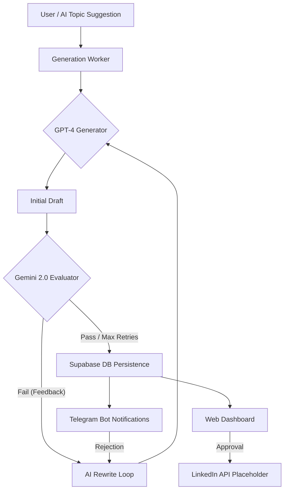

# 🤖 Redraft: Enterprise AI LinkedIn Content Engine

[](https://github.com/yourusername/redraft)
[](https://huggingface.co/spaces)
[](https://opensource.org/licenses/MIT)

**Redraft** is a high-performance, self-correcting AI pipeline designed to create and refine high-engagement LinkedIn content. With a multi-LLM orchestration layer (GPT-4 for creative generation and Gemini 2.0 Flash for objective evaluation), Redraft ensures every post sounds human and adheres to sophisticated brand guidelines.

---

## 🏗️ System Architecture

Redraft is built with a decoupled, event-driven mindset. It joins AI automation and human oversight, thanks to a human-in-the-loop (HITL) architecture.



---

## ✨ Key Features

### 🧠 Intelligent Self-Correction Loop
Unlike simple "one-shot" generators, Redraft has a **Recursive Evaluation Flow**. If a generated post contains AI buzzwords or corporate jargon, sounds robotic, or lacks clear value, the Gemini-powered evaluator provides structured feedback. The GPT-4 agent then rewrites the content until it meets a "human-likeness" score or is sent for manual review.

### 📱 Cross-Channel Review Workflow
*   **Web Dashboard**: A sleek web administrative interface with real-time statistics and a "Clear UI" mode for productivity.
*   **In-Place Redrafting**: Blurs background cards and provides live progress updates as the AI iterates on your feedback.
*   **Telegram Integration**: Approve or reject drafts on the go via a custom Telegram Bot. Rejecting a post via Telegram instantly triggers an AI rewrite loop on the server.

### 🕒 Scheduled Content Pipeline
*   **GitHub Actions Automation**: Pre-configured workflow to trigger a fresh content generation every 24 hours (Cron: `0 0 * * *`).
*   **Dashboard "Kill Switch"**: A database-backed toggle on the dashboard allows you to enable or disable the automated daily runs with a single click, providing full control without editing code.

### 🛡️ Production-Grade Engineering
*   **Persistence**: Powered by Supabase (PostgreSQL) for reliable data storage and activity logging.
*   **Robust Networking**: Custom `safe_execute` wrappers with exponential backoff to handle transient socket errors on Windows/High-load environments.
*   **Dockerized**: Fully containerized with Gunicorn for stable deployment on any cloud provider or Hugging Face Spaces.

---

## 🛠️ Technology Stack

| Layer | Technology |
| :--- | :--- |
| **Logic** | Python 3.11, Flask |
| **Generative AI**| OpenAI GPT-4 (Creative Intelligence) |
| **Evaluative AI**| Gemini 2.0 Flash (Objective Grading) |
| **Database** | Supabase (Managed PostgreSQL) |
| **Interface** | Vanilla JS, CSS3 (Glassmorphism), FontAwesome |
| **Notifications**| Python-Telegram-Bot (Async) |
| **Logging** | Rotating File Handler (Production standard) |

---

## 🚀 Getting Started

### Prerequisites
- Python 3.11+
- Supabase Account (Free tier works great!)
- OpenAI & Google Cloud API Keys

### Installation
```bash
# Clone the repository
git clone https://github.com/yourusername/redraft.git && cd redraft

# Install dependencies
pip install -r requirements.txt

# Configure environment
cp .env.example .env
# [Edit .env with your credentials]
```

### Running the Application
```bash
python app/main.py
```
Access the dashboard at `http://localhost:5000`.

---

## 🐳 Deployment Highlights

The project comes pre-configured for modern CI/CD flows:

**Docker & Docker Compose:**
The simplest way to run locally is using Docker Compose, which automatically handles your `.env` file and port mapping:

```bash
# Run with Docker Compose
docker compose up --build
```

Alternatively, use standard Docker commands:
```bash
docker build -t redraft-ai .
docker run -p 5000:7860 --env-file .env redraft-ai
```

**Hugging Face Spaces:**
This repository is optimized for the Hugging Face Docker SDK. Ensure your Space uses port `7860` and all API keys are registered in the **Secrets** tab of your settings.

---

## 📜 License
Distributed under the MIT License. See `LICENSE` for more information.

---

## 👋 Connect
Created by Ben Onwurah – follow my journey on [LinkedIn](https://www.linkedin.com/in/ben-onwurah)
